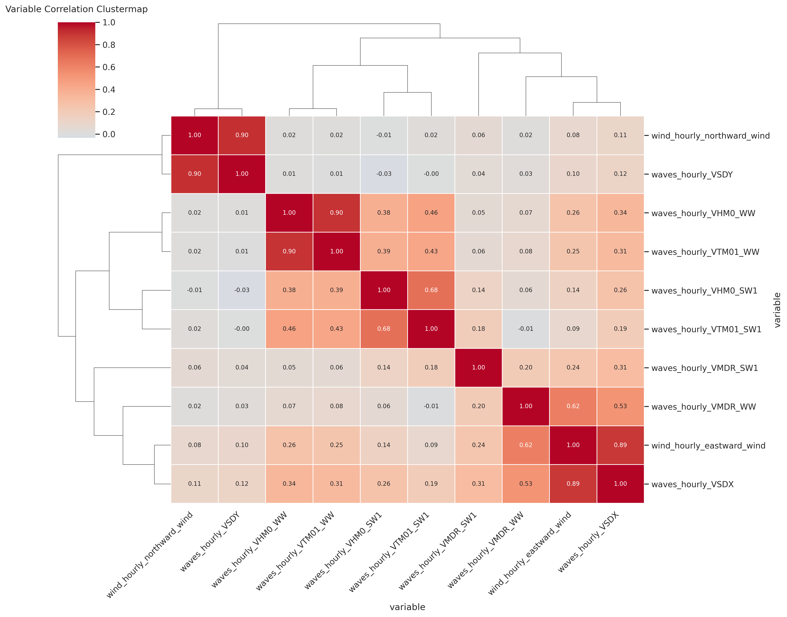
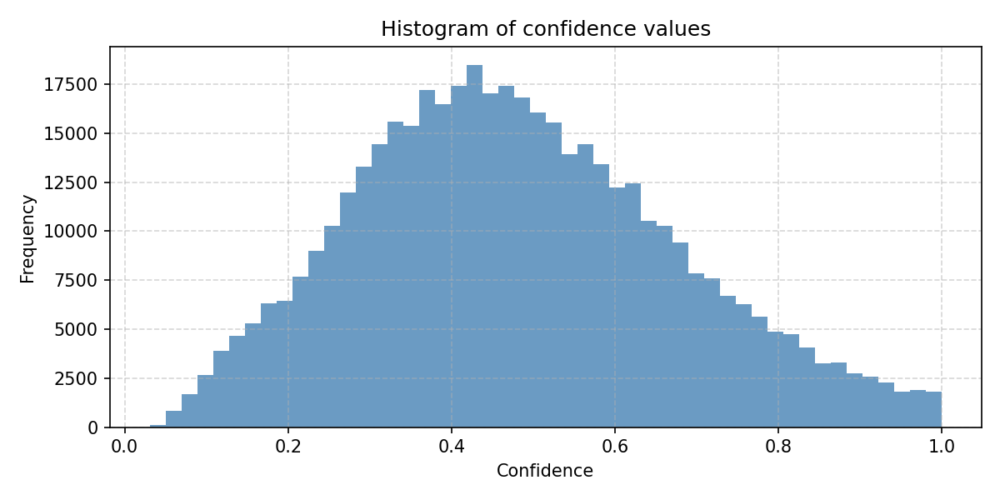
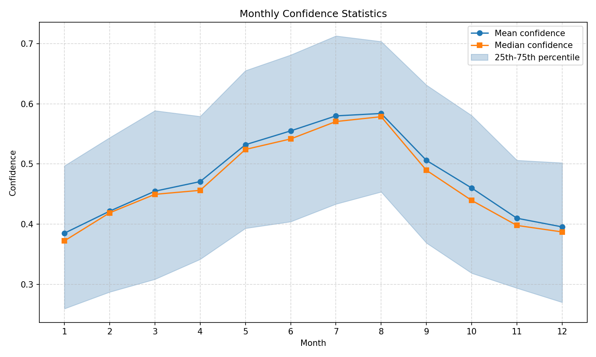

# eRutter: _Historical Sea Routing_

This repository provides an interactive web-based tool for exploring historical sailing routes using environmental data
and graph-based routing algorithms. It combines spatial and temporal environmental datasets to estimate plausible
maritime routes based on seasonal and environmental conditions. The tool may be useful for historians, geographers, and
researchers interested in maritime history, environmental impacts on sailing, and historical route reconstructions.


> ⚠️ **Note:** Both the vessel characteristics (`sailing_vessels.js`) and the sailing-time algorithm (`sailing.js`) are
> proof-of-concept and
> require refinement. Contributions are welcome, especially from domain experts with knowledge of historical or
> contemporary
> sailing vessel performance and environmental interactions.


- Vessel parameters can be loaded from
  a selection of preset vessel types, and adjusted manually.
- Return voyages can also be included.
- Auto-cycling of months facilitates exploration of seasonal route
  variations.
- Voyage distances and durations are logged for both outward and
  return journeys.
- The routes, logs, parameters, and data sources can be exported as GeoJSON for further analysis and visualisation.

## Demo

The Route Explorer is online here:
https://docuracy.github.io/Historical_Sea_Routing

## Methodology

Data processing in this project is divided into two principal stages: **preprocessing** and **dynamic (browser-based)
processing**.

The **preprocessing** stage is performed using a suite of Python scripts that acquire, transform, and integrate multiple
geospatial datasets. These include satellite-derived environmental variables, elevation models, and historical
geographic overlays. This stage is responsible for constructing the hexagonal grid infrastructure, associating
environmental attributes with each node, and computing theoretical visibility ranges. By performing these calculations
in advance, the system ensures that complex spatial relationships are efficiently encoded and ready for real-time
exploration.

The **dynamic processing** stage occurs entirely within the browser and is powered by JavaScript. It enables users to
interactively compute and visualise plausible sailing routes in near real time, based on selected vessel profiles and
seasonal environmental conditions. The browser-side logic includes an experimental cost-weighting algorithm that
estimates travel time between nodes by incorporating wind, currents, draught constraints, and weather-induced visibility
limitations.

This bifurcated processing architecture provides a scalable and extensible framework: the computationally intensive
tasks are handled offline during preprocessing, while lightweight, user-driven analyses are performed on demand in the
browser.

### Preprocessing

#### Geospatial Data Infrastructure

  
This project leverages the [H3 hexagonal hierarchical spatial index](https://h3geo.org/) to create a multi-resolution
grid system for
representing geographic areas. H3 provides consistent spatial coverage with hexagons at multiple resolutions, enabling
scalable
routing and environmental analysis. The blending of multiple resolutions allows minimisation of the graph size.

  
For sight-line computations, H3 cells at resolution 5 are placed over
land, and Digital Elevation Model (DEM) data are clipped to these hex boundaries.
The maximum elevation within each land cell is retained. To model visibility from sea, the horizon distance for each sea
cell is computed using Earth curvature geometry and the
maximum
land elevations. A radial comparison identifies which land cells are theoretically visible from each sea node, stopping
at the
first visible landmass within the horizon radius. The efficiencies of this approach allow for rapid sight-line analysis
without recourse to ray-casting.

#### Historical Geographic Data


The preprocessing pipeline includes Python scripts that support the application of spatial masks to reconcile
the contemporary geographic OpenStreetMap (OSM) coastlines with historical hydrographic reconstructions. For example,
the
[Viabundus](https://www.landesgeschichte.uni-goettingen.de/handelsstrassen/data/Viabundus-2-water-1500.geojson)
project's [Water (1500)](https://www.landesgeschichte.uni-goettingen.de/handelsstrassen/data/Viabundus-2-water-1500.geojson)
layer is applied in this way to mask land areas which have been reclaimed since the 16th century. A limitation is that
no oceanographic data are deployed in route-weighting for such areas.

#### Environmental Data

Environmental data plays a central role in the routing algorithm, representing the dynamic natural forces that
historically influenced maritime travel. Given the lack of detailed historical meteorological records, this project
employs carefully selected modern datasets as proxies for premodern conditions.

#### _Justification for Using Modern Environmental Data as a Proxy for Premodern Conditions_

Direct meteorological observations from premodern periods are sparse and geographically limited. To address this, the
model uses reanalysis and remote sensing data products to approximate past environmental conditions. Although climate
systems evolve, large-scale wind and wave patterns tend to exhibit significant stability at seasonal and regional scales
over decades and even centuries.

By focusing on modal (most typical) conditions, rather than averages or extreme events, this approach aligns well with
historical navigation needs:

* Routing decisions were shaped by dominant environmental conditions, not isolated anomalies.

* Modal climatologies highlight stable, recurring patterns that premodern mariners would have learned and exploited.

* The spatial scale of the H3 hexagonal grid aligns with modern dataset resolution and the generalised nature of
  historic vessel movement.

This proxy-based strategy supports practical, historically grounded simulation of maritime routes.

#### _Environmental Data Processing Overview_

This project uses two datasets from the Copernicus Marine Service, accessible via DOI:

* Wind and wave reanalysis: [WIND_GLO_PHY_L4_MY_012_006](https://doi.org/10.48670/moi-00185)
* Wave model: [GLOBAL_ANALYSISFORECAST_WAV_001_027](https://doi.org/10.48670/moi-00017)

The environmental processing pipeline reduces these high-resolution datasets into compact monthly modal composites,
ensuring efficient lookup of dominant conditions at each graph node while preserving meteorologically meaningful
information.

Key steps include:

* **Spatial Indexing:** Each H3 node is mapped to the nearest environmental data grid cell.

* **Discretisation:** Continuous variables (e.g., wind speed, wave height) are binned into categorical intervals.

* **Aggregation by Mode:** For each H3 cell and calendar month, the most frequently observed combination of binned
  environmental conditions is computed across two years of hourly data (~1,460–1,500 samples/month/location).

* **Optimised Storage:** The modal dataset is saved in compressed Zarr format for rapid access and scalability.

This transformation replaces terabytes of raw hourly data with a streamlined and simulation-ready climatological model.

#### _Correlation-Based Variable Reduction_

To reduce dataset complexity without compromising environmental fidelity, correlation analysis was conducted on hourly
data sampled from 1,000 randomly selected sea hexes.

* **Vector Decomposition**

  To enable meaningful comparisons and operations, wave magnitude and direction were converted into Cartesian vector
  components:

    ```math
    u = -H × sin(θ)
    v = -H × cos(θ)
    ```

  where _H_ is wave height and _θ_ is mean wave direction in radians. Components were derived for:

    - Wind waves: ww_u, ww_v
    - Swell waves: sw_u, sw_v

  This representation enables correlation analysis and vector-based reasoning.


* **Variable Elimination**

  The resulting correlation matrix revealed several high-correlation pairs:

  | Variable Pair                          | r           | Decision                      |
              | -------------------------------------- | ----------- | ----------------------------- |
  | Stokes Drift (`VSDX`, `VSDY`) vs. Wind | \~0.89–0.90 | Dropped                       |
  | Wind wave height vs. period            | \~0.90      | Period dropped                |
  | Wind vectors vs. Wave-derived vectors  | \~0.80–0.84 | Wind data dropped (see below) |



#### _Wind Proxy via Regression_

Given the strong linear relationship between wave-based and wind vector components, a regression model was used to
derive wind vectors from wave data:

* _eastward_wind ≈ β₀ + β₁ × ww_u_
* _northward_wind ≈ β₀ + β₁ × ww_v_

| Component | β₀       | β₁      |
|-----------|----------|---------|
| u         | -0.04379 | 0.96965 |
| v         | -0.00858 | 0.95177 |

These models provide highly accurate wind estimates from the higher-resolution wave fields, making them suitable
substitutes.

#### _Simplification Decision_

Because:

* The wind dataset is coarser in space and time, and
* Wave-based proxies offer comparable explanatory power at higher fidelity,

the wind dataset was removed from the pipeline entirely. This step improves performance and simplifies storage, while
retaining key directional forcing information.

#### _Modal Confidence and Validation_

Each modal value is computed from a sample of ~1,460–1,500 hourly data points per month and location, representing two
full years of observations.

**Confidence Score:** Modal confidence is defined as the frequency ratio of the most common bin combination (i.e., the
proportion of samples
in a month that match the modal condition). A higher score indicates stronger recurrence of that condition.

* High confidence in summer months suggests strong seasonality and environmental predictability.
* Lower confidence in other months reflects greater variability, consistent with real-world
  transitional weather.

This validation confirms that modal routing inputs are most stable, and thus most reliable, during peak seasonal
conditions.





#### _Visibility Reduction_

Modern meteorological data from the [Copernicus Climate Data Store](https://cds.climate.copernicus.eu/) are used to
estimate historical attenuation of visibility due to fog and rain.

### Dynamic Processing

The core routing logic is based on the Dijkstra bidirectional shortest path algorithm
from [graphology](https://graphology.github.io/),
with weights calculated dynamically via `sailing.js`.

The `sailing.js` module is a prototype implementation that estimates traversal cost (time) over each edge by factoring
in:

- **Distance**: Great-circle distance between source and target hex centroids.
- **Wind direction and speed**: Monthly averages, influencing effective sailing angle and speed.
- **Sea surface conditions**: Wave height and surface currents, where applicable.
- **Vessel parameters**: Sourced from `sailing_vessels.js`, including draught, beam, and ideal points of sail.
- **Bathymetry constraints**: Nodes or edges in shallow waters incur heavy penalties if the depth falls below vessel
  draught tolerance.

A custom weight function uses these inputs to simulate the effective time taken by a given sailing vessel across an edge
for a
specific month. The route finder adapts to seasonal conditions, allowing month-specific simulations of outward and
return legs.

### Longevity

A primary goal was to enable users to explore historical maritime routes entirely within the browser, without relying on
server-side processing or infrastructure. This approach protects the project from disruptions caused by changes in
funding, hosting, or technical support, problems which are common in DH projects.

## Coverage

Coverage is currently limited to Europe (as shown in the map at [Preprocessing](#preprocessing)), but can be extended to
other areas by running the included Python
scripts. A lighter-weight subgraph covering only the UK and Ireland can be loaded by appending `?aoi=UK-Eire` to the
URL.


## Limitations

- The in-browser processing approach can be resource-intensive for large datasets, potentially causing performance
  issues on less powerful devices.
- Loading very large graphs may result in significant delays or browser memory exhaustion.
- The lack of server-side support limits the ability to perform real-time data updates.
- Currently supports only certain maritime regions.
- The routing and estimation algorithms rely on simplified models that may not capture all historical navigational
  nuances.
- User interface and visualisation features may require further refinement for accessibility and ease of use.

## Calibration

The results generated by this tool should be checked against historical records of journey times and itineraries
where available, and the parameters of the vessel models should be adjusted accordingly.

> 💡 Contributions welcome: If you have access to historical shipping logs, port books, or travel diaries that document
> journey durations or routes, please consider submitting them (or links to them) via GitHub Issues or Pull Requests.
> Data
> from merchant, naval, or fishing vessels dated before 1700 and covering the North Sea, Baltic, English Channel,
> Eastern Atlantic, and Mediterranean regions would be particularly valuable.

For example:

- [Journal of Alexander Gillespie, skipper in Elie (1662-1685)](https://collections.st-andrews.ac.uk/item/journal-of-alexander-gillespie-skipper-in-elie/2078154)

  > "This journal records voyages undertaken by Alexander Gillespie. It contains general information about cargoes,
  ports and lengths of journeys; ... Gillespie's main voyages were one into the Baltic in the early summer, one to
  Bordeaux in the autumn for the first vintage, and occasionally a second."

- [Henry Teonge’s Diary, 1675–1676](https://babel.hathitrust.org/cgi/pt?id=hvd.hxjrrd&seq=11)

  > Teonge, an English naval chaplain, recorded daily positions, weather, and course during his voyages to the
  Mediterranean and Levant between June 1675 and November 1676, including leg-by-leg progress estimates.

## References and Data Sources

This project builds upon and is informed by the following key references:

- Holterman, Bart. "14 Sources and methods for the reconstruction of medieval and early modern sea routes in northern
  Europe". _Mobility in the Early Middle Ages, and Beyond – Mobilität im Frühmittelalter und darüber hinaus:
  Interdisciplinary Approaches – Interdisziplinäre Zugänge_, edited by Laury Sarti and Helene von Trott zu Solz, Berlin,
  Boston: De Gruyter, 2025, pp. 287-306. https://doi.org/10.1515/9783111166698-014
- Litvine, A.D., Lewis, J. & Starzec, A.W. A multi-criteria simulation of European coastal shipping routes in the ‘age
  of sail’. _Humanit Soc Sci Commun_ **11**, 666 (2024). https://doi.org/10.1057/s41599-024-02906-9

### Environmental Data Sources

- Copernicus Marine Environment Monitoring Service (CMEMS) datasets, including bathymetry, wave, and wind data.
- ERA5 reanalysis weather datasets from the Copernicus Climate Data Store.
- Digital Elevation Model (DEM) data from Mapzen's Terrarium tiles.

---
© 2025 Stephen Gadd

This work is licensed under the [CC BY-NC 4.0 License](https://creativecommons.org/licenses/by-nc/4.0/).